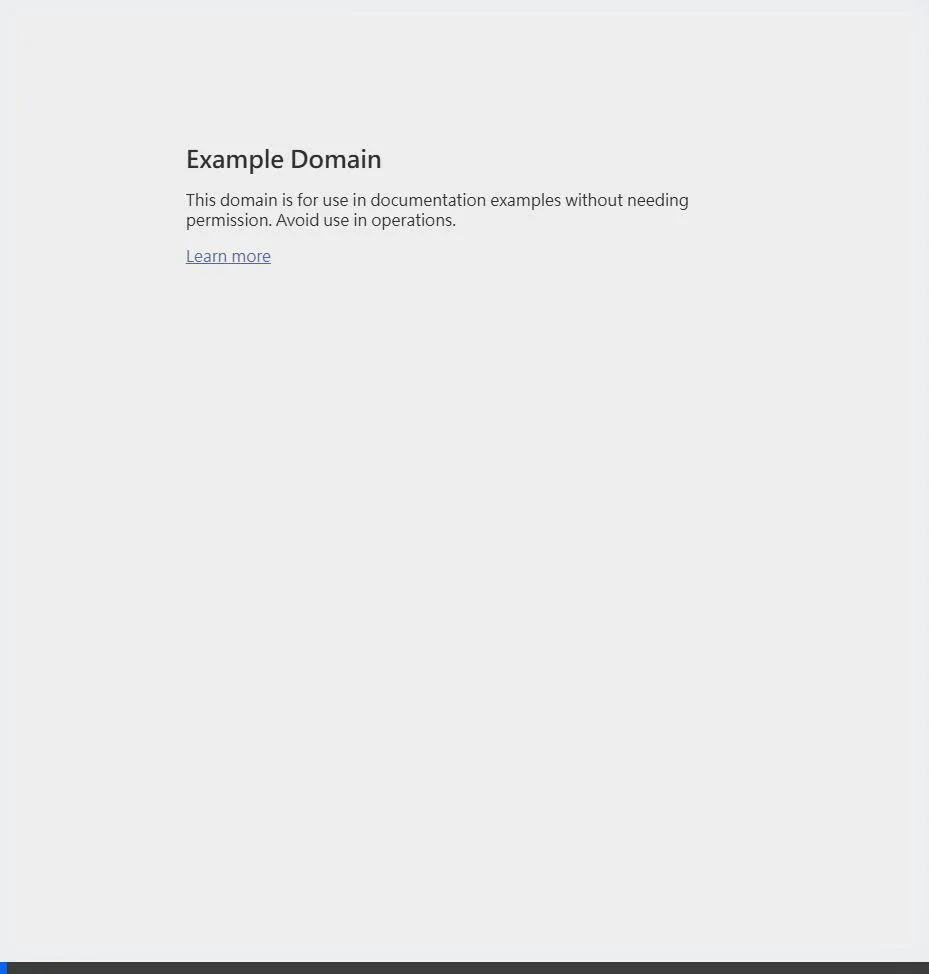
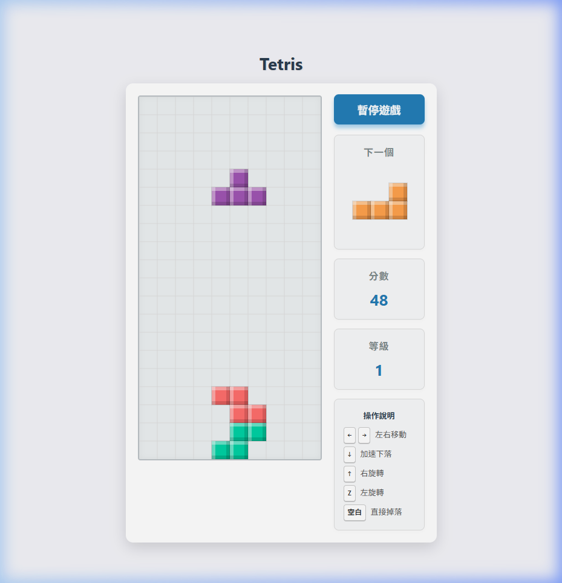

# 成果展示與說明 (Walkthrough)

## 開發成果
我們已經成功在 `index.html` 內建構了完整的單一檔案俄羅斯方塊遊戲，無需依賴外部素材。所有功能均已正常運作：
- 支援方向鍵控制（左右與下壓）、上鍵旋轉以及空白鍵直接落下 (Hard Drop)。
- 右側介面包含分數顯示及下一個方塊預覽。
- 方塊滿行時自動消除並發出音效，累積得分。

## 測試錄影記錄
以下是遊戲過程的自動化測試錄影記錄 (WebP 格式)：

## 驗證結果
- **控制測試**：確認上下左右按鍵與空白鍵響應順暢。
- **碰撞與消除**：邏輯均測試通過，方塊落地與消除計算正確無誤。
- **音效與預覽**：預覽視窗正確顯示下一形狀，消除時發出的短促音效運作正常。
